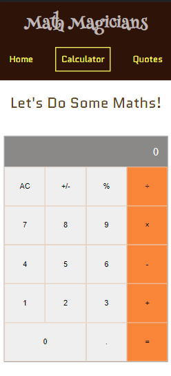
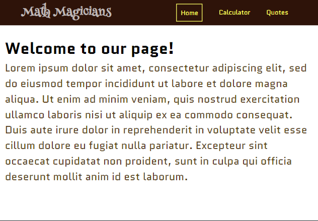

# Math Magicians

> This is a **Single Page App** _(SPA)_ that allows lovers of Mathematics make simple calculations.

> |Mobile Version|Desktop Version
> |--------------|--------------|
> |.||

This **Single Page App** _(SPA)_  was built with ReactJS. It has three pages:
- Home Page
- Calculator Page
- Quotes Page

These pages will display when their links in the navigation bar is clicked without the browser loading thanks to `React Router Library`.

On the Calculator Page, the user can perform `mathematical operations`;
- Addition
- Subtraction
- Multiplication
- Division

while the Quotes Page contains several `mathematical quotes` by great historians, and mathematicians. These quotes are randomly displayed and they change every 10 seconds.


## Built With

- ### Major languages
  - Javascript, CSS, and HTML
- ### Frameworks
  - ReactJS
- ### Technologies used
  - Webpack, Babelrc, Linters

## Live Demo

[Live Demo Link](https://gambit142.github.io/Math-Magicians/)


## Getting Started

To get a local copy up and running follow these simple example steps.

```
git clone https://github.com/Gambit142/Math-Magicians.git
```

and then run

```
npm i
npm start
```

## Installation

to build a production version to `bulid` folder run

```
npm run build
```

## Authors

👨🏿 **Francis Ugorji**

- GitHub: [@Gambit142](https://github.com/Gambit142)
- LinkedIn: [Francis Ugorji](www.linkedin.com/in/francis-ugorji-a567b7168/)

👨🏿 **Damilare Akintoye**

- GitHub: [@dami1080](https://github.com/dami1080)
- LinkedIn: [Damilare Akintoye](https://www.linkedin.com/in/damilare-akintoye-7b2248174/)


## 🤝 Contributing

Contributions, issues, and feature requests are welcome!

Feel free to check the [issues page](https://github.com/Gambit142/Math-Magicians/issues).

## Show your support

Give a ⭐️ if you like this project!

## Acknowledgments

- Hat tip to Microverse for the opprotunity to learn ReactJS using their platform

## 📝 License

This project is [MIT](./MIT.md) licensed.
